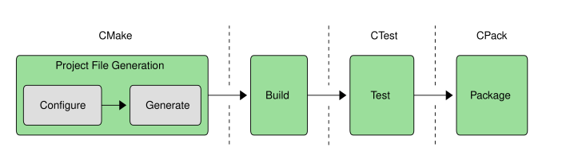
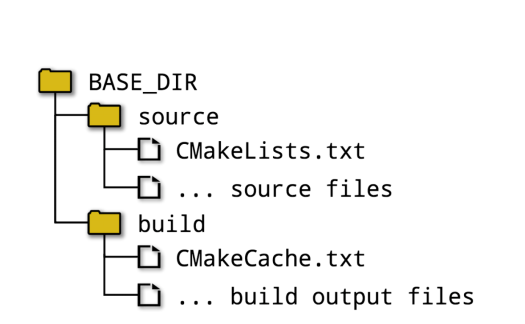
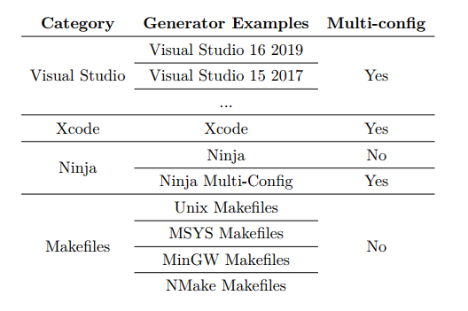

# CMake学习
> 学习如何使用CMake进行构建

## 基础知识

> CMake 是一套工具，涵盖了从创建构建到生产，以及发布的一切操作。不仅涵盖了从头到尾的流程，还有广泛的平台、工具和语言支持。

### 创建项目

CMake完整的构建流程如下图所示:

首先需要对项目进行描述，并生成特定于平台的项目文件，这些文件与开发人员选择的构建工具 (例如make、Xcode、Visual Studio等)适配。这是CMake有名的设置阶段，CMake工具套件还包括 CTest 和 CPack，分别用于管理测试和打包。

源目录和二进制目录概念是CMake的基础。源目录是CMakeLists.txt文件所在的文件夹，项目的源文件和构建所需的其他文件都组织在该位置下。二进制目录是生成构建内容的地方，通常称为构建目录。

CMake还在构建目录中创建一个CMakeCache.txt的特殊文件，存储各种信息，以便在后续运行时重用。CMakeLists.txt文件是项目的描述，生成的项目文件应该视为构建输出。开发人员处理项目需要确定构建目录相对于源目录的位置。有两种方式：源内构建和源外构建。
 
#### 源内构建

源目录和构建目录可以相同，但不推荐这样做，这种方式称为源内构建。内源构建的主要问题在于，构建输出与源文件混杂在一起。这种缺乏分离的方式导致目录与各种文件和目录混杂在一起，使得项目管理变得非常困难，并有着构建输出覆盖源文件的风险。这种方式还使版本控制系统的工作难度增加，因为有许多由构建创建的文件，源代码控制工具必须知道要忽略哪些文件，或者在提交时手动排除这些文件。源内构建的另一个缺点是，清除所有构建输出并使用干净的源重新开发非常困难。由于这些原因，不推荐开发人员在任何的情况下使用源内构建方式进行构建。

#### 源外构建

更可取的方式是让源目录和构建目录不同，这称为源外构建。这使得源文件和构建输出完全分离，从而避免了混合问题。源外构建还有一个优势，开发人员可以为同一个源目录创建多个构建目录，这就允许使用不同的选项设置构建项目，比如：Debug和Release版本等等。如图：


#### 生成项目文件
开发人员通过选择生成器来选择要创建的项目文件。 CMake 支持一系列生成器，下图列出了常用的生成器：

一些生成器支持多种配置(如Debug、Release等)，其允许开发者在不同的配置中进行选择，不必重新运行CMake，CMake很适合为Xcode和Visual  Studio等IDE生成项目文件。对于不支持多配置的生成器，开发人员必须重新运行 CMake 在 Debug、 Release 等之间切换构建方式。运行 CMake 最基本的方法是通过CMake命令行。调用它的最简单方法是将目录切换到 build目录，并将生成器类型和源树位置的选项传递给CMake。例如:
```shell
mkdir build
cd build
cmake -G " Unix  Makefiles " ../ source
```
若省略了-G选项， CMake 将根据平台选择默认的生成器类型。

对于所有的生成器类型，CMake将执行测试并询问系统，以确定如何建立项目文件。这包括验证编译器是否工作、确定支持的编译器特性集和其他各种任务。

上面展示了项目文件的创建时的两个步骤：配置和生成。在配置阶段，CMake 读取 CMakeLists.txt文件，并构建整个项目的内部表示文件。完成这些之后，生成阶段将创建项目文件。

#### 运行构建工具

```shell
cmake --build /some/path/build --config Debug --target MyApp
```
这种方式更适用于常用IDE的开发人员，--build选项指向CMake项目生成的构建目录。对于多个配置，--config选项指定要构建哪个配置，而单个配置生成器将忽略--config选项，而依赖于执行 CMake项目生成时的信息。--target选项可以用来告诉构建工具要构建什么目标，如果省略该选项，将构建默认目标。

## 深度构建

## 常用功能

## 