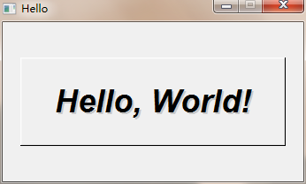
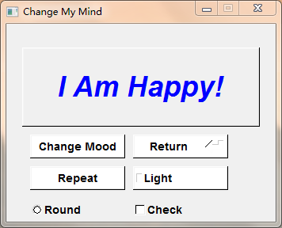
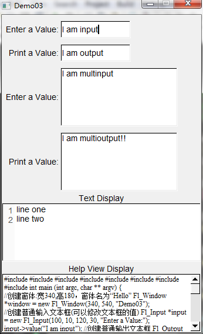
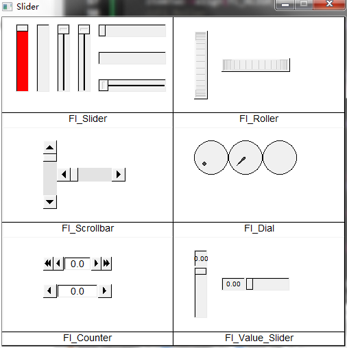

# FLTK踩坑之路：CodeBlocks配置FLTK库

## FLTK库

> 系统环境：Win7旗舰版
>
> CodeBlocks版本：20.3
>
> FLTK版本：1.3.8
>
> Mingw版本：4.2.1（CodeBlocks自带的编译器，无需额外配置编译器）

<!-- more -->

`本来想使用wxWidgets的，奈何wxWidgets的编译过于复杂且麻烦而且会出很多问题，于是改用FLTK`

### FLTK历史

FLTK正如他的名字Fast Light Tool Kit，是一个跨平台C++的GUI工具包，适用于 UNIX/Linux、Windows和Mac OS；FLTK 提供了很多GUI 功能，并通过 OpenGL及其内置的 GLUT 仿真支持 3D 图形。

### FLTK特点

1. 兼容GLUT库
2. 兼容XForms库
3. 支持 X11 和 WIN32 上的 OpenGL
4. 非常小且快速的便携式二维绘图库
5. 交互式用户界面构建器程序
6. sizeof(Fl_Widget) ==64
7. 直接在核心库上编写以实现最高速度，并针对代码大小和性能进行了优化 

### FLTK缺点

1. 不支持GB2312/GBK中文字符编码
2. 对于大型复杂的GUI比较吃力，推荐使用QT

### CodeBlocks集成FLTK

在官网[FLTK](https://www.fltk.org/) 下载FLTK的源码，我下载的是[`fltk-1.3.8-source.tar.gz`](https://www.fltk.org/pub/fltk/1.3.8/fltk-1.3.8-source.tar.gz)，下载完后进行解压，使用CMake进行编译，然后使用codeblocks打开，FLTK.cbp文件进行编译，得到编译后的文件如下：


在编译的build文件夹下新建一个文件夹include，将FLTK的源文件的头文件FLTK复制到新建的文件夹include下面。打开CodeBlocks进行库的配置，添加头文件到搜索目录，添加库文件到搜索目录，链接库文件。

### 第一个FLTK程序

```cpp
#include <FL/Fl.H>
#include <FL/Fl_Window.H>
#include <FL/Fl_Box.H>
int main (int argc, char ** argv) {
    //创建窗体:宽340,高180，窗体名为“Hello”
    Fl_Window *window = new Fl_Window(340, 180, "Hello");
    //创建弹性盒子，内容为“Hello World”
    Fl_Box *box = new Fl_Box(20, 40, 300, 100, "Hello, World!");
    //设置盒子的类型
    box->box(FL_UP_BOX);
    //设置盒子的字体样式
    box->labelfont(FL_BOLD + FL_ITALIC);
    //设置盒子字体大小
    box->labelsize(36);
    //设置盒子标签的类型
    box->labeltype(FL_SHADOW_LABEL);
    //窗体内容结束
    window->end();
    //显示窗口并进行事件循环
    window->show(argc, argv);
    return Fl::run();
}
```



### FLTK按钮

```cpp
#include <FL/Fl.H>
#include <FL/Fl_Window.H>
#include <FL/Fl_Button.H>
#include <FL/Fl_Return_Button.H>
#include <FL/Fl_Light_Button.H>
#include <FL/Fl_Repeat_Button.H>
#include <FL/Fl_Round_Button.H>
#include <FL/Fl_Check_Button.H>
Fl_Box *box = (Fl_Box*)0;
int flag = 0;
void confirm_cb(Fl_Widget *w, void *data);
int main (int argc, char ** argv) {
    char *data = "I Am Sad!";
    //创建窗体:宽340,高180，窗体名为“Demo02”
    Fl_Window *window = new Fl_Window(340, 250, "Demo02");
    //创建弹性盒子
    box = new Fl_Box(20, 30, 300, 100, "I Am Happy!");
    box->box(FL_UP_BOX);
    box->labelfont(FL_BOLD + FL_ITALIC);
    box->labelsize(36);
    box->labeltype(_FL_SHADOW_LABEL);
    box->labelcolor(FL_BLUE);
    //创建标准按钮
    Fl_Button *btn = new Fl_Button(30, 140, 120, 30, "Change Mood");
    btn->color(FL_WHITE);
    btn->labelfont(FL_BOLD);
    //绑定快捷键
    btn->shortcut(FL_CTRL + 't');
    btn->callback((Fl_Callback*)confirm_cb, data);
    //创建返回按钮
    Fl_Return_Button *retBtn = new Fl_Return_Button(160, 140, 120, 30, "Return");
    retBtn->color(FL_WHITE);
    retBtn->labelfont(FL_BOLD);
    //创建重复按钮
    Fl_Repeat_Button *repBtn = new Fl_Repeat_Button(30, 180, 120, 30, "Repeat");
    repBtn->color(FL_WHITE);
    repBtn->labelfont(FL_BOLD);
    //创建开关按钮
    Fl_Light_Button *lgBtn = new Fl_Light_Button(160, 180, 120, 30, "Light");
    lgBtn->color(FL_WHITE);
    lgBtn->labelfont(FL_BOLD);
    //创建单选按钮(矩形)
    Fl_Round_Button *rouBtn = new Fl_Round_Button(30, 220, 120, 30, "Round");
    rouBtn->color(FL_WHITE);
    rouBtn->labelfont(FL_BOLD);
    //创建单选按钮(圆形)
    Fl_Check_Button *checkBtn = new Fl_Check_Button(160, 220, 120, 30, "Check");
    checkBtn->color(FL_WHITE);
    checkBtn->labelfont(FL_BOLD);
    window->end();
    //显示窗口并进行事件循环
    window->show(argc, argv);
    return Fl::run();
}
void confirm_cb(Fl_Widget *w, void *data) {
    if(flag == 0) {
        box->label((char *)data);
        flag = 1;
    } else {
        box->label("I Am Happy!");
        flag = 0;
    }
}
```



### FLTK文本框

```cpp
#include <FL/Fl.H>
#include <FL/Fl_Window.H>
#include <FL/Fl_Input.H>
#include <FL/Fl_Output.H>
#include <FL/Fl_Multiline_Input.H>
#include <FL/Fl_Multiline_Output.H>
#include <FL/Fl_Text_Editor.H>
#include <FL/Fl_Help_View.H>
int main (int argc, char ** argv) {
    //创建窗体:宽340,高180，窗体名为“Demo03”
    Fl_Window *window = new Fl_Window(340, 540, "Demo03");
    //创建普通输入文本框(可以修改文本框的值)
    Fl_Input *input = new Fl_Input(100, 10, 120, 30, "Enter a Value:");
    input->value("I am input");
    //创建普通输出文本框
    Fl_Output *output = new Fl_Output(100, 50, 120, 30, "Print a Value:");
    output->value("I am output");
    //创建多行输入文本框
    Fl_Multiline_Input *multiInput = new Fl_Multiline_Input(100, 90, 200, 100, "Enter a Value:");
    multiInput->value("I am multinput");
    //创建多行输出文本框
    Fl_Multiline_Output *multioutput = new Fl_Multiline_Output(100, 200, 200, 100, "Print a Value:");
    multioutput->value("I am multioutput!!");
    //创建Text展板
    Fl_Text_Buffer *buff = new Fl_Text_Buffer();
    Fl_Text_Display *disp = new Fl_Text_Display(0, 320, 340, 100, "Text Display");
    disp->buffer(buff);
    buff->text("line one\nline two");
    disp->linenumber_width(20);
    //创建一个带滚动的多行input框
    Fl_Help_View *help = new Fl_Help_View(0, 440, 340, 100, "Help View Display");
    help->load("./main.cpp.save");
    //窗体内容结束
    window->end();
    //显示窗口并进行事件循环
    window->show(argc, argv);
    return Fl::run();
}
```



### FLTK滑块

```cpp
#include <FL/Fl.H>
#include <FL/Fl_Window.H>
#include <FL/Fl_Box.H>
#include <FL/Fl_Counter.H>
#include <FL/Fl_Dial.H>
#include <FL/Fl_Roller.H>
#include <FL/Fl_Scrollbar.H>
#include <FL/Fl_Slider.H>
#include <FL/Fl_Value_Slider.H>
int main (int argc, char ** argv) {
    //创建窗体:宽340,高180，窗体名为“Slider”
    Fl_Window *window = new Fl_Window(500, 480, "Slider");
    Fl_Box *item = new Fl_Box(0, 0, 250, 480, "ItemOne");
    item->color(FL_WHITE);
    item->box(FL_UP_BOX);
    item->align(FL_ALIGN_BOTTOM);
    //创建box
    Fl_Box *box = new Fl_Box(0, 0, 250, 140, "Fl_Slider");
    box->color(FL_WHITE);
    box->box(FL_UP_BOX);
    box->align(FL_ALIGN_BOTTOM);
    //Fl_Slider
    Fl_Slider *slider = new Fl_Slider(20, 10, 20, 100);
    slider->type(FL_VERTICAL);
    slider->color(FL_RED);
    Fl_Slider *sliderTwo = new Fl_Slider(50, 10, 20, 100);
    sliderTwo->type(FL_VERT_FILL_SLIDER);
    Fl_Slider *sliderThree = new Fl_Slider(80, 10, 20, 100);
    sliderThree->type(FL_VERT_NICE_SLIDER );
    Fl_Slider *sliderFour = new Fl_Slider(110, 10, 20, 100);
    sliderFour->type(FL_VERT_NICE_SLIDER );
    Fl_Slider *sliderFive = new Fl_Slider(140, 10, 100, 20);
    sliderFive->type(FL_HORIZONTAL);
    Fl_Slider *sliderSix = new Fl_Slider(140, 50, 100, 20);
    sliderSix->type(FL_HOR_FILL_SLIDER);
    Fl_Slider *sliderSeven = new Fl_Slider(140, 90, 100, 20);
    sliderSeven->type(FL_HOR_NICE_SLIDER);
    //Fl_Scrollbar
    Fl_Box *boxScorll = new Fl_Box(0, 160, 250, 140, "Fl_Scrollbar");
    boxScorll->color(FL_WHITE);
    boxScorll->box(FL_UP_BOX);
    boxScorll->align(FL_ALIGN_BOTTOM);
    Fl_Scrollbar *sbar = new Fl_Scrollbar(60, 180, 20, 100);
    Fl_Scrollbar *sbarTwo = new Fl_Scrollbar(80, 220, 100, 20);
    sbarTwo->type(FL_HORIZONTAL);
    //Fl_Counter
    Fl_Box *boxCot = new Fl_Box(0, 320, 250, 140, "Fl_Counter");
    boxCot->color(FL_WHITE);
    boxCot->box(FL_UP_BOX);
    boxCot->align(FL_ALIGN_BOTTOM);
    Fl_Counter *cot = new Fl_Counter(60, 350, 100, 20);
    Fl_Counter *cotTwo = new Fl_Counter(60, 390, 100, 20);
    cotTwo->type(FL_SIMPLE_COUNTER);
    Fl_Box *itemTwo = new Fl_Box(250, 0, 250, 480, "ItemTwo");
    itemTwo->color(FL_WHITE);
    itemTwo->box(FL_UP_BOX);
    itemTwo->align(FL_ALIGN_BOTTOM);
    //Fl_Roller
    Fl_Box *boxRoller = new Fl_Box(250, 0, 250, 140, "Fl_Roller");
    boxRoller->color(FL_WHITE);
    boxRoller->box(FL_UP_BOX);
    boxRoller->align(FL_ALIGN_BOTTOM);
    Fl_Roller *roller = new Fl_Roller(280, 20, 20, 100);
    Fl_Roller *rollerTwo = new Fl_Roller(320, 60, 100, 20);
    rollerTwo->type(FL_HORIZONTAL);
    //Fl_Dial
    Fl_Box *boxDial = new Fl_Box(250, 160, 250, 140, "Fl_Dial");
    boxDial->color(FL_WHITE);
    boxDial->box(FL_UP_BOX);
    boxDial->align(FL_ALIGN_BOTTOM);
    Fl_Dial *dial = new Fl_Dial(280, 180, 50, 50);
    Fl_Dial *dialTwo = new Fl_Dial(330, 180, 50, 50);
    dialTwo->type(FL_LINE_DIAL);
    Fl_Dial *dialThree = new Fl_Dial(380, 180, 50, 50);
    dialThree->type(FL_FILL_DIAL);
    //Fl_Value_Slider
    Fl_Box *boxValue_Slider = new Fl_Box(250, 320, 250, 140, "Fl_Value_Slider");
    boxValue_Slider->color(FL_WHITE);
    boxValue_Slider->box(FL_UP_BOX);
    boxValue_Slider->align(FL_ALIGN_BOTTOM);
    Fl_Value_Slider *vSlider = new Fl_Value_Slider(280, 340, 20, 100);
    Fl_Value_Slider *vSliderTwo = new Fl_Value_Slider(320, 380, 100, 20);
    vSliderTwo->type(FL_HORIZONTAL);
    //窗体内容结束
    window->end();
    //显示窗口并进行事件循环
    window->show(argc, argv);
    return Fl::run();
}

```


