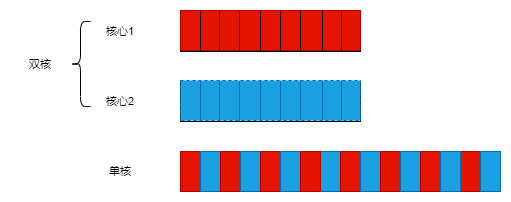

# Cpp并发编程

> C++11首次实现了对多线程的支持

## 简介

在计算机中并发就是指在单个系统里同时执行多个独立的任务,而非顺序的进行一些活动。

以前，大多数计算机只有一个处理器，具有单个处理单元(processingunit)或核心(core),如今还有很多这样的台式机。这种机器只能在某一时刻执行一个任务，不过它可以每秒进行多次任务切换。通过“这个任务做一会，再切换到别的任务，再做一会儿”的方式，让任务看起来是并行执行的。这种方式称为“任务切换(taskswitching)”。

在一个双核机器(具有两个处理核心)上，每个任务可以在各自的处理核心上执行。在单核机器上做任务切换时，每个任务的块交织进行。但它们中间有一小段分隔(图中所示灰色分隔条的厚度大于双核机器的分隔条);为了实现交织进行，系统每次从一个任务切换到另一个时都需要切换一次上下文，任务切换也有时间开销。进行上下文的切换时，操作系统必须为当前运行的任务保存CPU的状态和指令指针，并计算出要切换到哪个任务，并为即将切换到的任务重新加载处理器状态。然后，CPU可能要将新任务的指令和数据的内存载入到缓存中，这会阻止CPU执行任何指令，从而造成的更多的延迟。如下图所示:


<!-- more -->

1. 多进程并发

	 将应用程序分成多个独立的进程，他们在同一时刻运行。独立的进程可以通过进程间常规的通信渠道传递信息。缺点是：进程间通信通常复杂并且速度慢。而且运行多个进程需要固定开销。优点是可以更容易编写安全的并发代码，并且可以使用远程连接。
	
2. 多线程并发
		
	 多线程并发指在单个进程中运行多个线程。线程很类似于轻量级的进程，每个线程相互独立运行。但是进程中的所有线程都共享地址空间，并且所有线程可以访问到大部分数据。
	
## C++多线程历史


1. C++98标准不承认线程的存在，并且各种语言要素的操作效果都以顺序抽象机的形式编写。不仅如此，内存模型也没有正式定义，所以在C++98标准下，没办法在缺少编译器相关扩展的情况下编写多线程应用程序。
2. 随着C++11标准的发布，不仅有了一个全新的线程感知内存模型，C++标准库包含：用于管理线程、保护共享数据、线程间同步操作以及低级原子操作的各种类。

### 第一个多线程例子

```Cpp
#include<iostream>
// 导入管理线程的函数和类的头文件
#include<thread>
// 创建线程的初始函数hello
void hello(){
	std::cout<<"hello Concurrent world!\n";
}

int main(){
	std::thread t(hello);
	// 主线程等待t线程运行
	t.join();
	return 0;
}
```

## 线程管理

> 每个程序都至少有一个线程：执行main函数的线程，其余线程有各自的入口函数。

```Cpp
#include<iostream>
#include<thread>
class back_task{
	public:
		void do_something()const{
			std::cout<<"do something...\n";
		}
		void operator()()const{
			do_something();
		}
};
int main(){
	back_task b;
	std::thread  t(b);
	t.join();
	return 0;
}
```

可以把函数对象传入线程构造函数时，需要注意：*不能传递一个临时变量，而是要传递一个命名变量;传递临时变量时，C++编译器会将其解析为函数声明，而不是类型对象的定义。*

可以使用lambda表达式避免这个问题：

```cpp
#include<iostream>
#include<thread>
void do_something(){
	std::cout<<"hello world!\n";
}
int main(){
	std::thread  t([]{
		do_something();	
	});
	t.join();
	return 0;
}
```
*必须在`std::thread`对象销毁前进行join或者detach。*

如果不等待线程，就必须保证线程结束之前，可访问的数据得有效性。下面这段代码oops函数已经结束，线程依旧还访问局部变量：
```Cpp
struct func
{
	int& i;
	func(int& i_) : i(i_) {}
	void operator() ()
	{
		for (unsigned j=0 ; j<1000000 ; ++j)
		{
			do_something(i); // 1. 潜在访问隐患： 悬空引用
		}
	}
};
void oops()
{
	int some_local_state=0;
	func my_func(some_local_state);
	std::thread my_thread(my_func);
	my_thread.detach(); // 2. 不等待线程结束
} // 3. 新线程可能还在运行
```

处理这种情况的常规方法：使线程函数的功能齐全，将数据复制到线程中，而非复制到共享数据中。还可以通过join的方式来确保线程在函数完成前结束。

### 等待线程完成
如果需要等待线程完成，相关的thread实例可以使用`join()`，调用join()的行为，还清理了线程相关的存储部分。
