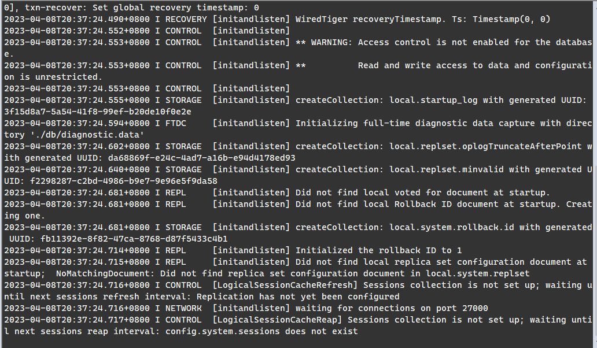
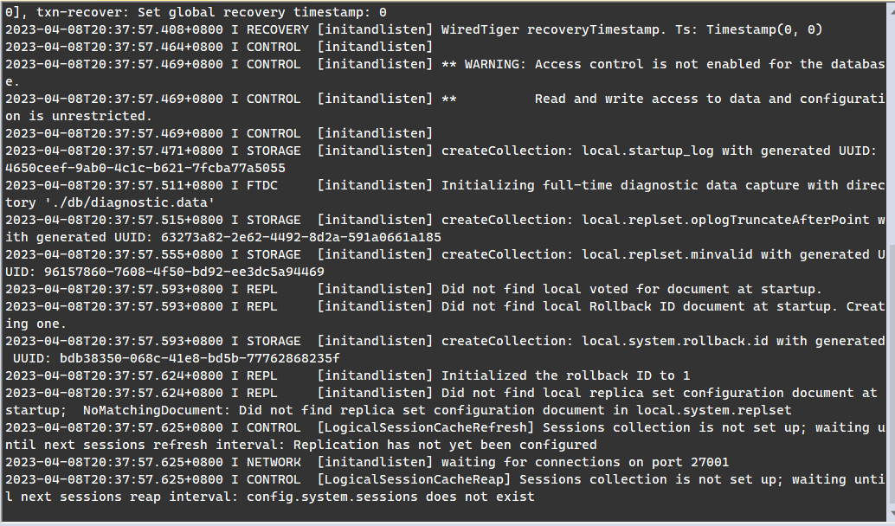
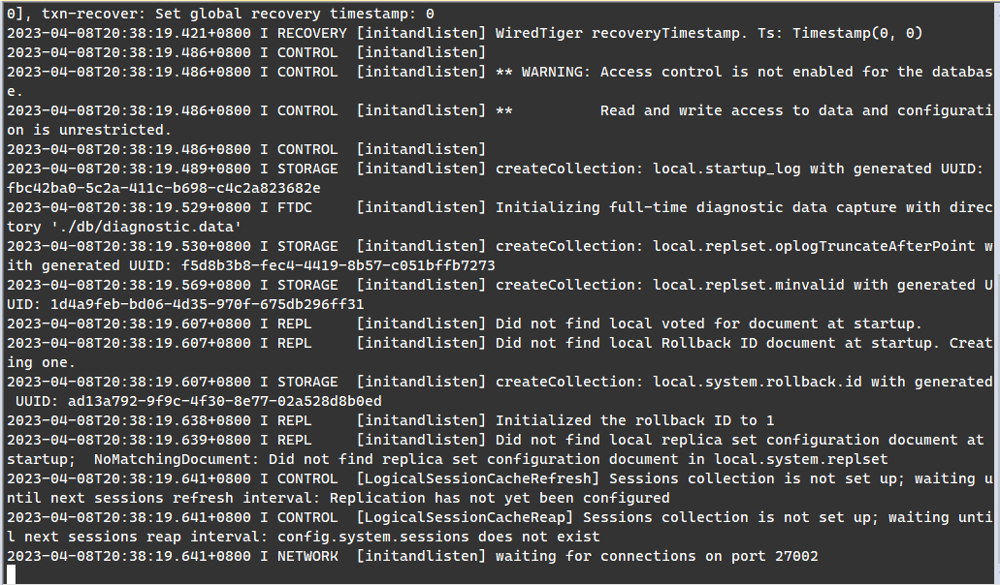
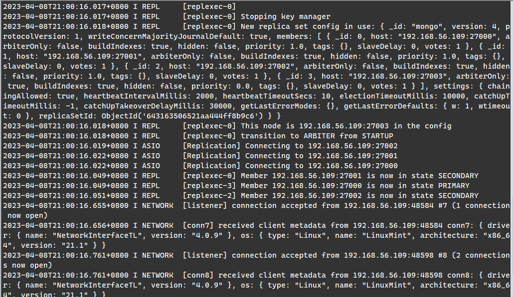
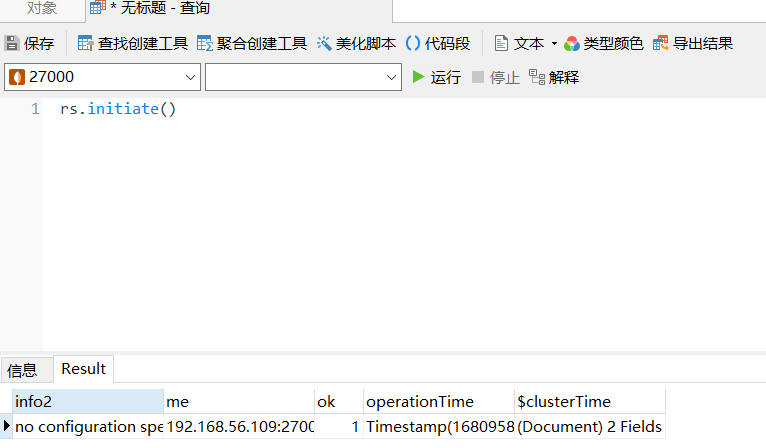
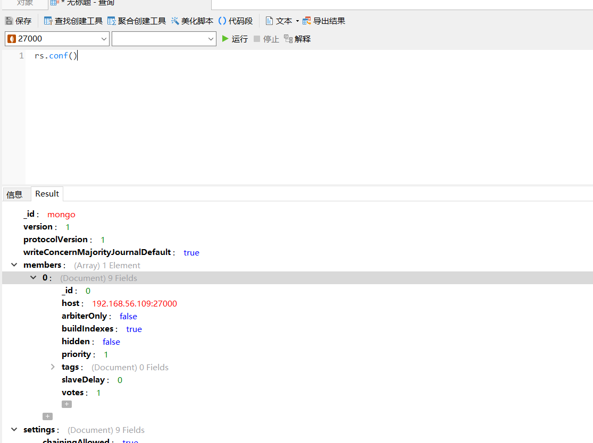
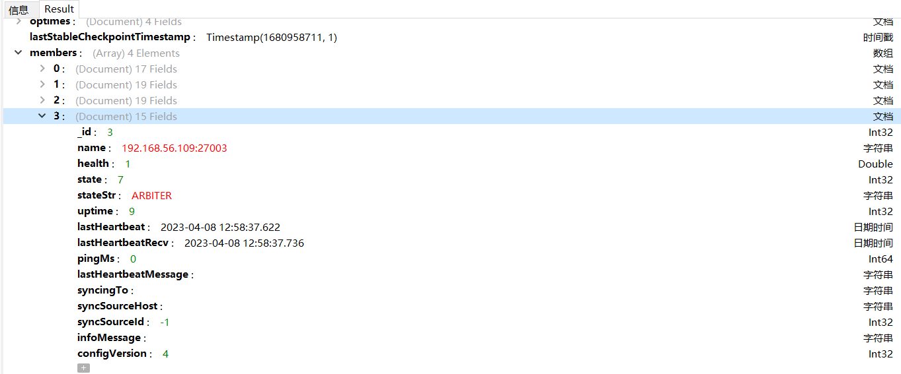
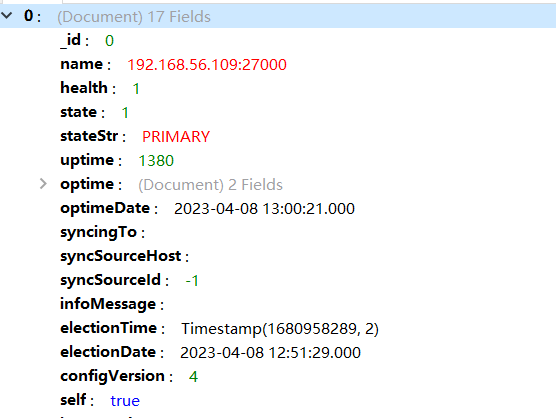
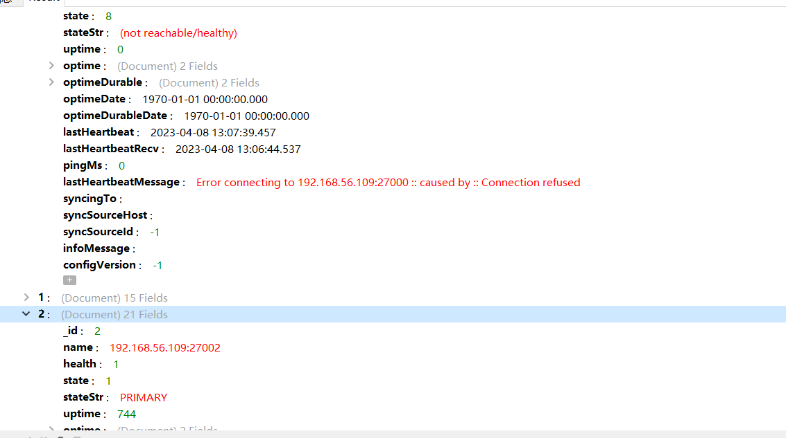

# MongoDB数据库

## MongoDB概述

MongoDB是一种强大、灵活、可扩展的数据存储方式，拓展了关系型数据库的众多有用功能。比如：辅助索引、范围查询和排序。MongoDB是面向文档的数据库。

MongoDB具有的功能：（不支持联接和多行事务）

1. 索引：支持通用的辅助索引、提供唯一的、复合的和地理空间索引能力。
2. 存储Javascript：可以直接在服务端存取Javascript的函数和值。
3. 聚合：支持MapReduce和其他聚合工具。
4. 固定集合：集合大小是有上限的。
5. 文件存储：支持用一种容易试用的协议存储大型文件和文件的元数据。

<!-- more -->

## 文档的增删改查

### 插入文档

##### 使用insert插入一个文档

```sql
db.student.insert({"name":"张三"});
```

##### 批量插入文档

`一次批量插入只是单次的TCP请求`，通过批量插入可以避免很多零散的请求所带来的开销。

##### 插入的原理和作用

当执行插入时，使用的驱动程序会将数据转换成BSON的形式，然后将其送入数据库，由数据库进行解析，首先检测是否包含"_id"键，并且文档不超过4MB，但是除此之外不做别的数据验证，仅仅只是简单地将文档原样存入数据库中。

### 删除文档

##### 使用remove删除文档

```sql
db.student.remove({})
```

##### 使用remove删除特定文档

```sql
db.student.remove({"name":"张三"});
```

### 更新文档

##### $set

$set用来指定一个键的值，如果键不存在，则创建它。

```sql
db.student.update({"name":"张三"},{"$set":{"age":20}});
```

##### $inc

$inc用来增加已有键的值(只能为数字),或者在键不存在时创建一个键。

```sql
db.student.update({"name":"张三"},{"$inc":{"age":20}});
```

#### 数组修改器

##### $push

如果指定的键已经存在，$push会向已有数组的末尾加入一个元素，要是没有就会创建一个数组。

```sql
db.student.update({"name":"张三"},{"$push":{"comment":{"name":"Joe"}}});
```

##### $ne&&$addToSet

如果一个值不在数组里面就把它加进去。$addToSet可以避免重复。将$addToSet与$each进行组合可以添加多个不同的值。

```sql
db.student.update({"name":"张三"},{"$addToSet":{"email":{"each":["123456@qq.com","666666@qq.com"]}}});
```

##### $pop

可以使用$pop从数组的任何一端删除元素。-1表示从头部删除，1表示从尾部删除。

```sql
db.student.update({"name":"张三"},{"$pop":{"email":-1}});
```

##### $pull

$pull可以实现基于特定条件来删除元素。

```sql
db.list.insert({ "todo": ["dishes", "laundry", "dry cleaning"] });
db.list.find({});
db.list.update({},{"$pull":{"todo":"laundry"}});
```

##### upsert

upsert是一种特殊的更新，要是没有文档符合更新条件，就会以这个条件和更新文档为基础创建一个新文档。如果找到了匹配的文档，则正常更新。update第三个参数指定为true则表示为upsert。

##### save

save可以在文档不存在时插入，存在时更新。若文档含有“_id”，save会调用upsert，否则会调用插入。

#### 更新多个文档

默认情况下，更新只对符合匹配条件的第一个文档执行操作，要使所有匹配到的文档都得到更新，可以设置update的第四个参数为true。

#### 返回已更新的文档

使用findAndModify可以返回已更新的文档。

### 查询

查询所有记录。

```sql
db.student.find({});
```

#### 指定返回的键

可以通过find的第二个参数来指定想要的键。值为0则表示剔除该键。

```sql
db.student.find({},{ "name": 1, "age": 1 });
```

#### 查询条件

##### 比较查询

1. $lt相当于<
2. $lte相当于<=
3. $gt相当于>
4. $gte相当于>=
5. $ne相当于!=

##### OR查询

1. $in：用来查询一个键的多个值。
2. $nin：与$in相对。
3. $or：对多个键进行or查询就是使用这个。

##### $not进行取反

##### 对数组进行查询

1. $all
2. $size
3. $slice

## MongoDB主备

这里我采用的操作系统是`LinuxMint`,由于MongoDB4.x版本不在支持主备，所以这里暂不展示。

## MongoDB副本集

> 优点：主节点宕机后，会从副本节点中选举出新的主节点。
>
> - 数据冗余：副本集可以确保副本结点与主结点数据的更新，以防止单个数据库的服务宕机造成数据丢失的问题。这些副本结点可以和主结点位于同一个数据中心或出于安全考虑分布于其他数据中心。
> - 主挂副顶：副本集没有固定的主结点，整个集群会选举出一个主结点，当这个主结点不会正常工作时，会选举一个副本结点切换为主结点，客户端会连接到这个新的主结点，并且数据和应用程序都将保持可用。MongoDB副本集实现这样的主/副本切换是自动的，因此副本集是保证MongoDB高可用的基础。
> - 读写分离：副本集可以将读取请求分流到所有副本集上，以减轻主结点的读写压力。

### 副本集的角色

#### 主结点

主结点是副本集中负责处理客户端请求和读写数据的主要成员。主节点通过iplog(操作日志)记录所有操作。副本集中有且只有一个主结点，如果当主结点不可用时，则会从副本结点中选举出新的主结点。

#### 副节点

副本结点定期轮询主结点来获取oplog记录的操作内容，然后对自己的数据副本执行这些操作，从而保证副本结点的数据副本与主结点保持一致。副本集中可以有一个或者多个副本结点。当主结点宕机时，副本集会根据副本结点的优先级进行选举，确定哪个副本结点成为新的主结点。

#### 仲裁节点

仲裁结点不会同步主结点的数据副本，也不会被选举为主结点，它主要时参与选举投票。由于仲裁结点没有访问压力，比较空闲，因此仲裁结点需要的资源很小。 

### 副本集部署

首先创建好四个文件夹，分别为27000，27001，27002，27003。里面包含`mongod`、`db`文件夹和一个配置文件。这里我们将27003作为仲裁者。

配置文件内容为：

```txt
port=27000                     
dbpath=./db
bind_ip=192.168.56.109
replSet=mongo
```

然后执行：`./mongod --config=配置文件名`启动三个服务









```sql
//初始化集群
rs.initiate()
```



```sql
//查看集群配置，此时只有一个服务
rs.conf()
```



```sql
//向集群中添加members，此时有三个服务，分别为27000，27001，27002
rs.add("192.168.56.109:27001")
rs.add("192.168.56.109:27002")
//再添加一个仲裁者
rs.addArb("192.168.56.109:27003")
```



此时使用下面的语句查看集群状态，发现27000为主节点：

```sql
//查看集群的状态
rs.status()
```



然后此时我们停止27000的服务，然后连接27001的服务，使用`rs.status()查看集群状态`发现27000出现连接不可达，27002通过选举成为了主节点。至此我们就实现了副本集的部署。



