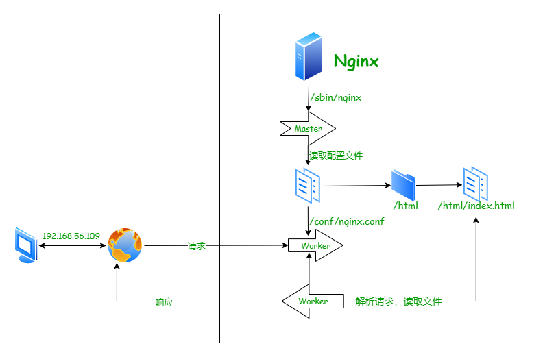
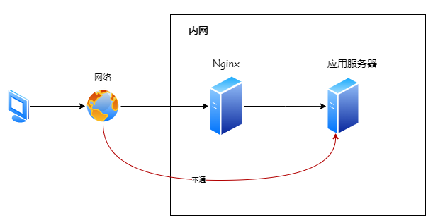

# Nginx学习

> 本次主要是基于LinuxMint操作系统进行操作。LinuxMint操作系统类似于Ubuntu系统。

## Nginx下载安装 

首先去官网下载[nginx](https://nginx.org/download/nginx-1.22.1.tar.gz)安装包,这里我选择的是nginx1.22.1版本。

然后安装好相关依赖:
```shell
# 安装pcre库
sudo apt-get install libpcre3 libpcre3-dev -y
# 安装zlib库
sudo apt-get install zlib1g-dev -y
```
```shell
# 解压nginx压缩包
tar -zxvf nginx-1.22.1.tar.gz
# 对nginx压缩包重命名
mv nginx-1.22.1 nginx
cd nginx
# 安装nginx
./configure --prefix=/usr/local/nginx
make
make install
# 进入安装的目录
cd /usr/local/nginx
# 启动nginx
sudo ./nginx
```
```shell
# 编写服务脚本
vim /usr/lib/systemd/system/nginx.service
```
```txt
# 内容如下
[Unit]                                                                                                                        
Description=nginx - web server
After=betwork.target remote-fs.target nss-lookup.target 
[Service]
Type=forking
PIDFile=/usr/local/nginx/logs/nginx.pid
ExecStartPre=/usr/local/nginx/sbin/nginx -t -c /usr/local/nginx/conf/nginx.conf
ExecStart=/usr/local/nginx/sbin/nginx -c /usr/local/nginx/conf/nginx.conf
ExecReload=/usr/local/nginx/sbin/nginx -s reload
ExecStop=/usr/local/nginx/sbin/nginx -s stop
ExecQuit=/usr/local/nginx/sbin/nginx -s quit
PrivateTmp=true 
[Install]
WantedBy=multi-user.target
```
```shell
# 重启服务
systemctl daemon-reload
# 查看以及启动的nginx进程
ps -ef |grep nginx
# 终止nginx进程
sudo kill -9 nginx的进程号
# 启动nginx进程
systemctl start nginx.service
# 设置开机自启动
systemctl enable nginx.service
# 查看nginx的状态
systemctl status nginx.service
```
## Nginx响应流程


## ServerName的匹配规则

1. 完整匹配
2. 通配符匹配
3. 正则匹配

## 反向代理



可以通过proxy_pass反向代理到公网

## 负载均衡

使用upstream和proxy_pass实现负载均衡（默认情况是使用轮询，缺点是:无法保持会话）,nginx的配置文件如下：
```shell
#user  nobody;
# 工作的进程的个数
worker_processes  1;
#error_log  logs/error.log;
#error_log  logs/error.log  notice;
#error_log  logs/error.log  info;
#pid        logs/nginx.pid;
# 事件驱动模块
events {
    # worker可以创建多少连接
    worker_connections  1024;
}
# http模块
http {
    # 引入请求头文件
    include       mime.types;
    default_type  application/octet-stream;
    #log_format  main  '$remote_addr - $remote_user [$time_local] "$request" '
    #                  '$status $body_bytes_sent "$http_referer" '
    #                  '"$http_user_agent" "$http_x_forwarded_for"';
    #access_log  logs/access.log  main;
    sendfile        on;
    #tcp_nopush     on;
    #keepalive_timeout  0;
    keepalive_timeout  65;
    #gzip  on;
    #与server同级
    upstream tomcat{
        server 192.168.56.109:8080;
        server 192.168.56.109:8081;
    }
    server {
        listen       80;
        server_name  localhost;
        #charset koi8-r;
        #access_log  logs/host.access.log  main;
        location / {
        	# 配置负载均衡
            proxy_pass http://tomcat;
            #root   html;
            #index  index.html index.htm;
        }
        #error_page  404              /404.html;
        # redirect server error pages to the static page /50x.html
        #
        error_page   500 502 503 504  /50x.html;
        location = /50x.html {
            root   html;
        }
        # proxy the PHP scripts to Apache listening on 127.0.0.1:80
        #
        #location ~ \.php$ {
        #    proxy_pass   http://127.0.0.1;
        #}
        # pass the PHP scripts to FastCGI server listening on 127.0.0.1:9000
        #
        #location ~ \.php$ {
        #    root           html;
        #    fastcgi_pass   127.0.0.1:9000;
        #    fastcgi_index  index.php;
        #    fastcgi_param  SCRIPT_FILENAME  /scripts$fastcgi_script_name;
        #    include        fastcgi_params;
        #}
        # deny access to .htaccess files, if Apache's document root
        # concurs with nginx's one
        #
        #location ~ /\.ht {
        #    deny  all;
        #}
    }
    # another virtual host using mix of IP-, name-, and port-based configuration
    #
    #server {
    #    listen       8000;
    #    listen       somename:8080;
    #    server_name  somename  alias  another.alias;
    #    location / {
    #        root   html;
    #        index  index.html index.htm;
    #    }
    #}
    # HTTPS server
    #
    #server {
    #    listen       443 ssl;
    #    server_name  localhost;
    #    ssl_certificate      cert.pem;
    #    ssl_certificate_key  cert.key;
    #    ssl_session_cache    shared:SSL:1m;
    #    ssl_session_timeout  5m;
    #    ssl_ciphers  HIGH:!aNULL:!MD5;
    #    ssl_prefer_server_ciphers  on;
    #    location / {
    #        root   html;
    #        index  index.html index.htm;
    #    }
    #}

}
```
可以通过在upstream模块中配置每台服务器的权重（值越大表示，权重越高）：
也可以使用down进行停用，使用backup进行备用。
```shell
upstream tomcat{
        server 192.168.56.109:8080 weight=8 down;
        server 192.168.56.109:8081 weight=2;
        server 192.168.56.109:8083 weight=1 backup;
}
```
其他负载均衡方式：（url_hash和fair需要第三方插件）
1. ip_hash:根据客户端的ip地址转发同一服务器，可以保持会话。
2. least_conn:最少连接数访问。
3. url_hash:根据url进行定向转发。
4. fair:根据后端服务器的响应时间进行转发。

## 动静分离

直接使用location进行配置即可。

### URLRewrite伪静态
> 可以隐藏url参数
1. last:继续向下匹配
2. break：不在继续匹配
3. redirect：302临时重定向
4. permanet：301永久重定向
在location中配置，如：`rewrite ^/([0-9]+).html$ /index.jsp?pageNum=$1 break`

### 防盗链

> 配置在location下面
1. none:检测Referer头不存在的情况。
2. blocked: 检测Referer头的值被防火墙或者代理服务器删除或伪装的情况。
3. server_names:设置一个或多个URL,检测Referer头是否是URL中的一个。

```shell
location ~*/(js|img|css){
	valid_refers 192.168.56.109;
	if($valid_refers){
		return 403;
	}
	root html;
	index index.html index.htm;
}
```
### 安装keepalived实现高可用
```shell
apt install keepalived -y
```


