# 深度学习之路：Python配置Pytorch

> 本文为Python配置Pytorch库，利用Anaconda包管理工具

## 查看电脑显卡配置

打开电脑的设备管理器查看显示适配器配置，如果有NVIDIA则可以采用GPU方式，我的电脑没有NVIDIA所以不支持GPU，所以后面只能采用CPU方式（采用CPU方式进行训练会很慢）：


<!-- more -->

## 下载Anaconda

由于使用Pip进行Pytorch库的安装，过程中坑实在太多，根据网上的建议选用Anaconda这个也很优秀的Python第三库的包管理工具。为节省时间可以采用清华源镜像进行下载[Anaconda](https://mirrors.tuna.tsinghua.edu.cn/anaconda/archive/)选择[Anaconda3-5.3.1-Windows-x86_64.exe](https://mirrors.tuna.tsinghua.edu.cn/anaconda/archive/Anaconda3-5.3.1-Windows-x86_64.exe)进行下载：

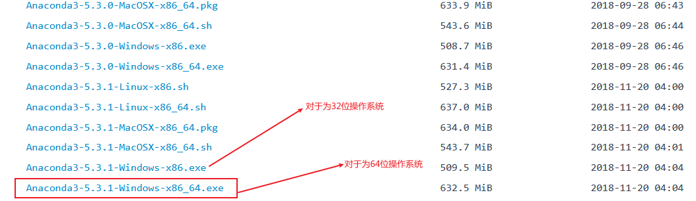

下载完成后进行安装

## 安装Anaconda

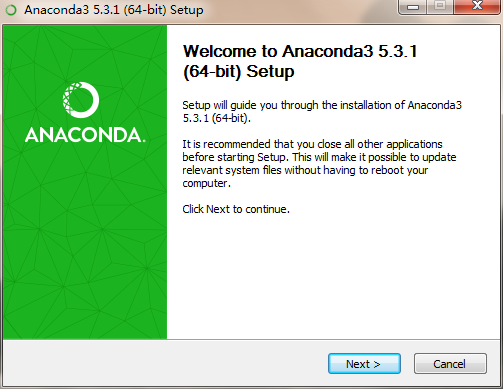

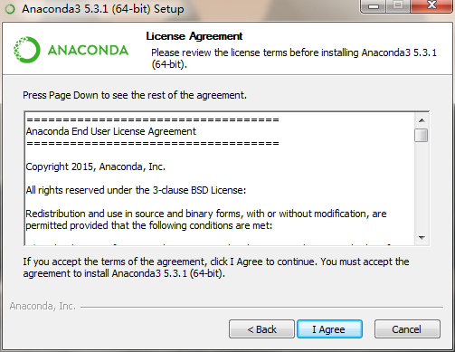

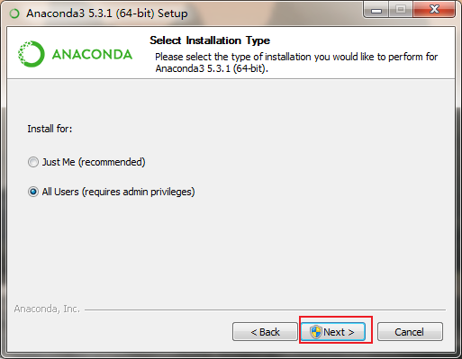

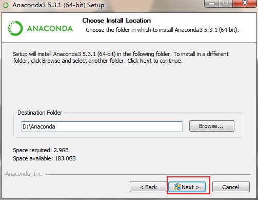

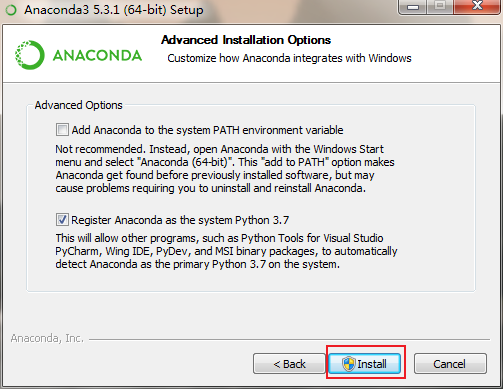

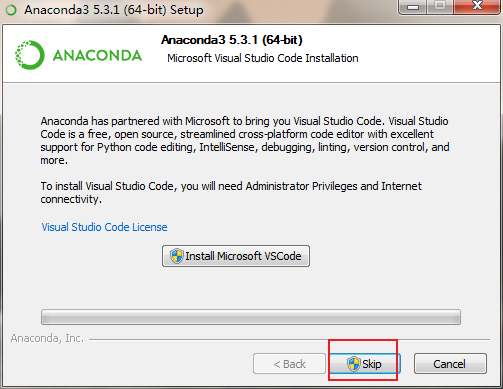


### Anaconda配置环境变量

将D:\Anaconda;D:\Anaconda\Scripts;D:\Anaconda\Library\bin;加入到环境变量Path中

打开命令行CMD输入`conda --version`

```shell
conda --version
```

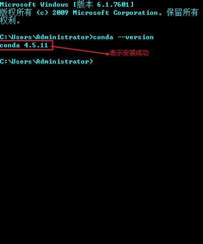

### Conda虚拟环境配置

在后面的项目我们可能遇见不同的项目需要用到不同环境，此时可以使用虚拟环境：

使用conda创建一个pytorch的环境，指定Python版本为3.7

```shell
conda create -n pytorch python=3.7
```

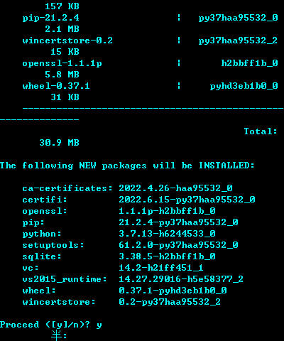

使用下面的命令查看当前环境，带`*`的为当前所处环境

```shell
conda info --envs
```

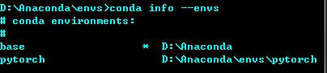

先使用activate激活base环境

```shell
activate
```

再使用`conda activate pytorch`激活pytorch这个环境

```shell
conda activate pytorch
```


## 安装CUDA和CUDNN（如无独显则跳过此步）

> 查看CUDA的[官方文档](https://docs.nvidia.com/cuda/cuda-installation-guide-microsoft-windows/index.html)
>
> 查看cuDNN的[官方文档](https://docs.nvidia.com/deeplearning/cudnn/install-guide/index.html)

第一步：首先根据显卡的驱动程序版本找到对应的Cuda Toolkit

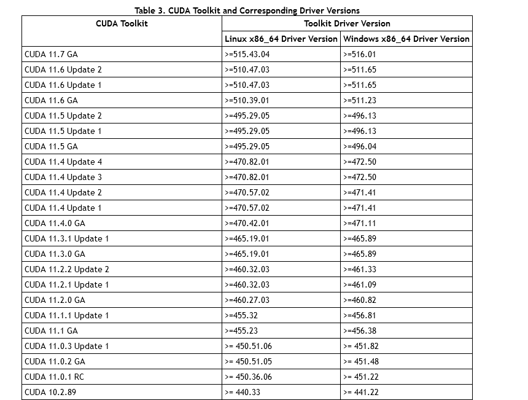

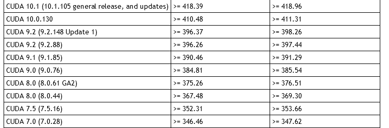

第二步：找到对应的CUDA，在此处[下载](https://developer.nvidia.com/cuda-toolkit-archive)

第三步：找到对应的cuDNN,在此处[下载](https://developer.nvidia.com/rdp/cudnn-archive)

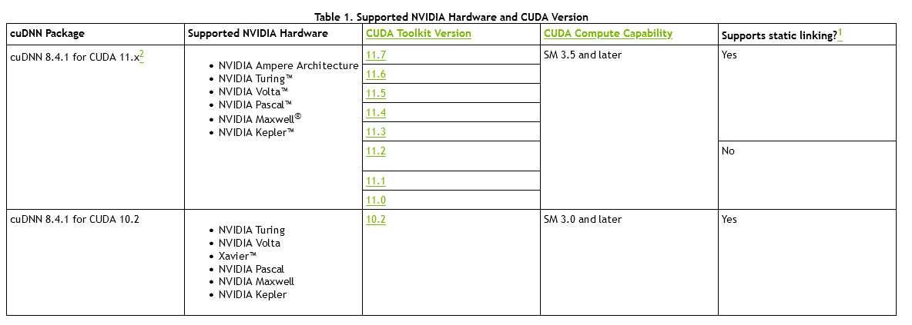

第四步：解压cuDNN文件，将bin,include,lib复制到CUDA目录下

第五步：配置CUDA的环境变量，将CUDA下的include,lib,libnvvp配置到Path路径下

第六步：验证是否安装成功，打开CMD，输入nvcc -V查看CUDA版本

## 安装Pytorch

第一步：进入[Pytorch官网](https://pytorch.org)，点击首页Install


第二步：找到自己所需配置


即打开CMD运行下面的命令进行Pytorch(使用CUDA-10.2)的安装：

```shell
CUDA-10.2 PyTorch builds are no longer available for Windows, please use CUDA-11.6
```

由于我电脑无独立显卡只有核显所以我只能选择CPU方式进行安装：


即打开CMD运行下面的命令进行Pytorch的安装：

```shell
conda install pytorch torchvision torchaudio cpuonly -c pytorch
```

至此Pytorch配置完毕！！！

## Pytorch入门

