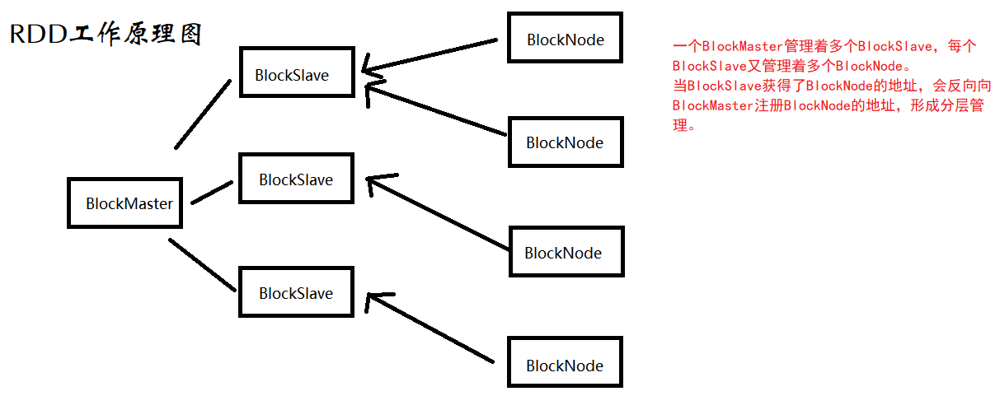
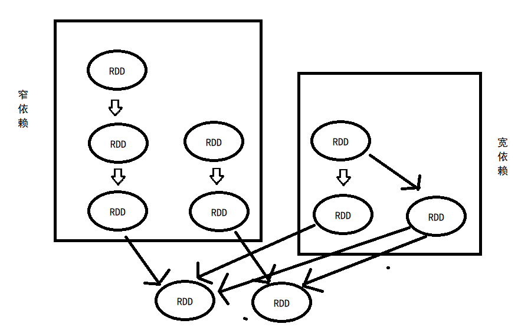

# Spark机器学习实践

> “大数据就是任何超过了一台计算机处理能力的庞大数据量。” ———— JohnRauser

## 大数据分析的五个方面

1. 有效的数据质量

   任何数据分析都是来源于真实的数据基础，而一个真实的数据是采用标准化的流程和工具对数据进行处理得到的。

2. 优秀的分析引擎

   对于大数据来说，数据源多种多样，特别是非结构化数据来源的多样性给大数据分析带来了新的挑战。

3. 合适的分析算法

   在对算法的选择上，不仅要考虑能处理的大数据的数量，还要考虑到对大数据处理的速度。

4. 对未来的合理预测

   数据分析的目的就是对已有数据体现出来的规律进行总结，并将现象与其他情况紧密相连，从而获得对未来发展趋势的预测。

5. 数据结果的可视化

   大数据的分析必然要求数据可视化能够直观反映出经过分析后得到的信息与内容。

<!-- more -->

## Spark简介

> Apache Spark是加州大学伯克利分校的AMPLabs开发的开源分布式轻量级通用计算框架，与传统的数据分析框架相比，Spark在设计之初就是基于内存设计，因此
> 其具有更高的处理性能。

Spark的最核心的部分就是MLlib。MLlib是一个构建在Spark上的、专门针对大数据处理的并发式高速机器学习库，特点就是采用较为先进的迭代式、内存存储的分析计算， 使得数据的计算处理速度大大高于普通的数据处理引擎。

### Spark安装

第一步:下载安装[JDK](https://www.oracle.com/java/technologies/downloads/#license-lightbox)并配置好相应的环境变量

第二步:下载安装[Scala](https://downloads.lightbend.com/scala/2.13.8/scala-2.13.8.zip)并解压同时配置好环境变量

第三步：下载安装[Hadoop](https://dlcdn.apache.org/hadoop/common/hadoop-3.3.4/hadoop-3.3.4-src.tar.gz)并配置好环境变量，同时将文件夹下的hadoop.dll拷贝到系统的System32文件夹下

第四步：在IDEA中安装Scala插件

### 经典的WordCount案例

> 统计文章中每个单词出现的次数

首先准备数据集wc.txt:

```txt
good bad cool
hadoop spark mllib
good spark mllib
cool spark bad
```

```scala
package com.bigdata.spark

import org.apache.spark.{SparkConf, SparkContext}

object WordCount {
  def main(args: Array[String]): Unit = {
    //    创建环境变量
    val conf = new SparkConf().setMaster("local").setAppName("wordCount")
    val sc = new SparkContext(conf) //创建环境变量实例
    val data = sc.textFile("D:\\SparkWorkSpace\\bigdata\\src\\main\\resources\\wc.txt") //读取文件
    data.flatMap(_.split(" ")).map((_, 1)).reduceByKey((_ + _)).collect().foreach(println) //word计数
  }
}
```

## RDD详解

定义：RDD是Resilient Distributed Datasets的简称，又叫做弹性分布式数据集，表示RDD实质上是存储在不同节点计算机中的数据集。 

分布式存储的好处：可以让数据在不同的工作节点上并行存储，以便在需要数据的时候并行运算。

RDD一大特性是延迟计算，即一个完整的RDD运行任务被分为两部分：Transformation和Action

1. Transformation

   Transformation用于RDD的创建。

2. Action

   Action是数据的执行部分，其通过count、reduce和collect方法去真正执行数据的计算部分。RDD所有的操作都是使用Lazy模式运行的，Lazy是一种程序优化的特殊形式。运行在编译的过程中不会立刻得到结果，而是记住所有的操作步骤和方法，只有显式的调用启动命令才进行计算。

分布式数据对于容错性的处理主要采用：检查节点和更新记录两种方式

### 与其他分布式共享内存的区别

DSM是一种常用的分布式框架，但是其在进行大规模计算时，对于容错性的容忍程度不够，常常由于一个节点产生错误就导致整个任务失败。

RDD与一般DSM有很大差别，RDD框架限制了批量读写数据的操作，有利于提高容错性。RDD所采用的模式是更新记录的方式去主动维护任务的运行，RDD不会单独等待某个节点的任务完成。

### RDD缺陷

RDD*不适合*作为一个数据的存储和抓取框架，因为RDD主要执行在多个节点中的批量操作，也就是说一个简单的写操作也会分为两个步骤进行，从而反而会降低运行效率。

### RDD工作原理



### RDD相互依赖

RDD依赖的生成方式由两种方式组成：宽依赖和窄依赖。

如果每个RDD只有一个父RDD，这种方式称为窄依赖；如果对于一个RDD有多个父RDD，那么这种就称为宽依赖。



### RDD	API详解

#### aggregate：对给定数据集进行方法设定

```scala

```

