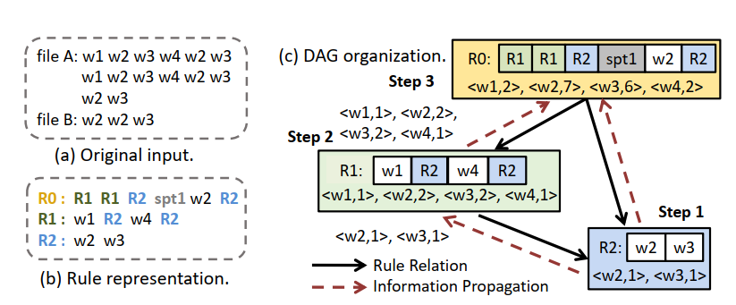
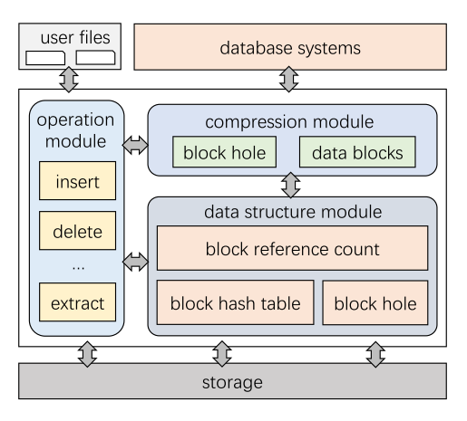
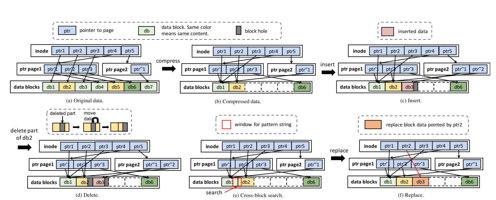
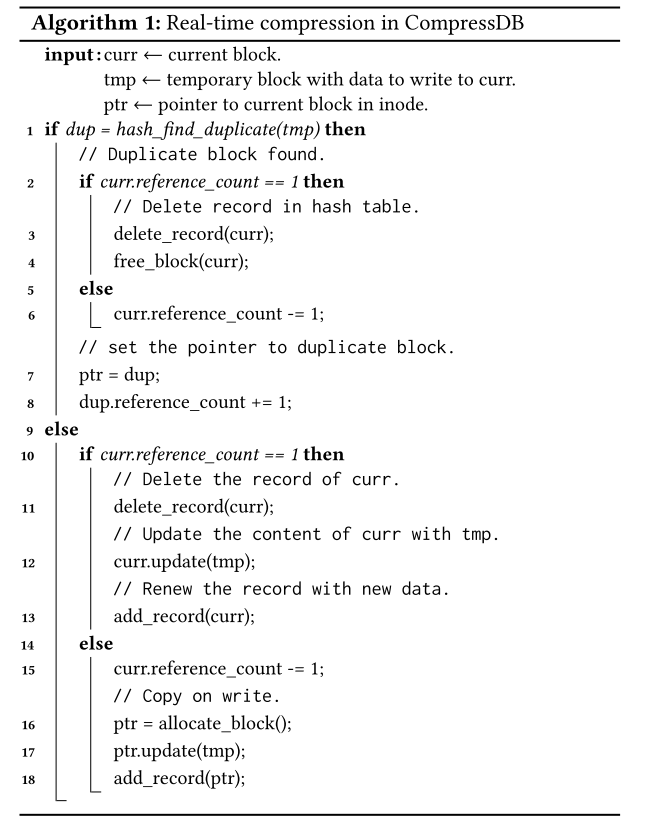
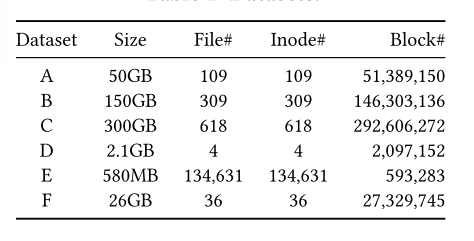
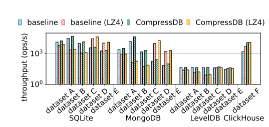
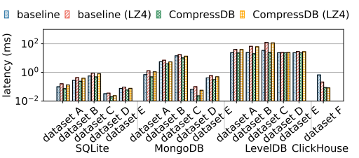
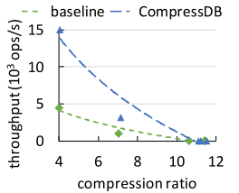

# 论文阅读汇总

> 从文体要素中知，论文具有三大要素：论点、论据和论证。先通过摘要了解论文大致内容，然后阅读引言、结论和讨论部分。在结果部分，要注意文中的出现的表格和图。最后阅读研究方法。

## CompressDB:Enabling Efficient Compressed Data Direct Processing for Various Databases

> CompressDB：为各种数据库直接提供高效的数据压缩。CompressDB是一个存储引擎。支持数据库的数据处理，而无需解压缩。

***keywords：*** compression, compressed data direct processing, database systems

### Abstract部分

在现代数据管理系统中，对于大数据问题，直接对压缩数据执行操作被认为是很好的处理方式。目前的系统只关注数据查询，但是对于一个完整的大数据系统必须同时支持数据查询和数据操作。本文提到的一个新的存储引擎CompressDB，它可以在不需要对数据解压缩的前提下支持数据库的数据处理。

CompressDB的优点有：
1. 利用上下文无关的语法来压缩数据，同时支持数据查询和数据操作。
2. 为了提高适应性，将CompressDB集成到了文件系统中，从而各种数据库可以直接使用compressDB，而不需要做任何更改。
3. 将操作下推到存储，这样就可以在存储系统中执行数据查询和操作，而不会将大量数据带到内存中，从而提高效率。

评估方法：在单节点和集群环境中使用六个具有不同长度、结构和内容的真实世界数据集来评估我们的方法。

实验结果：CompressDB的吞吐量提高了40%，延迟减少了44%，平均压缩率为1.81。

### Introduction部分

现代大数据系统正面临着呈指数级增长的数据卷，并使用数据压缩来减少存储占用空间。**为了避免不断压缩和解压缩操作的开销**，现有的研究系统开始探索直接对压缩数据执行大数据操作。

现有的解决方案在只读查询处理方面显示出了巨大的潜力，但一个功能齐全的大数据系统必须同时支持数据查询和数据操作。特别的对于一个系统来说必须要支持随机记录的更新以及插入和删除。

然而，以前的解决方案本身并不支持这些功能，因此每次进行修改时都必须解压缩和重新压缩相对较大的数据块，从而导致显著的性能开销。

本文试图去开发一种能够直接对压缩数据进行更新、插入和删除，从而实现一个既支持数据查询又支持操作的空间高效的大数据系统。

现有的压缩技术大多针对压缩比或读操作进行了优化；用于压缩数据的数据结构不适于修改。例如：

1. ***Succinct*** 是一个支持对压缩数据进行查询的数据库；它的压缩技术基于索引和后缀数组，其中压缩元素相互依赖，这使得如果一个小的数据单元需要更新，它的效率非常低。
2. ***TADOC(text analytics direct on compression)*** 它使用了基于规则的压缩策略。TADOC使用规则来表示多次出现的内容。

CompressDB采用了基于规则的压缩，并限制了其规则生成的深度；同时，CompressDB通过对语法规则的操作，可以对数据进行实时压缩和操作。创新点：
1. 在元素级别提出了一种新的规则内数据空洞的数据结构。
2. 在规则级别为随机更新提供了高效的规则定位和规则分割。
3. 在DAG级别减少了规则组织的深度以提高效率。

通过利用新的数据结构和算法设计，CompressDB在无需解压缩的情况下可以高效地进行数据操作，这是以前基于压缩的系统所不支持的。

论文的贡献：
1. 开发了高效的数据操作。除了对于以前的随机访问支持之外，还可以支持数据查询和数据操作。
2. 将CompressDB集成到了文件系统中。从而CompressDB可以支持各种数据库，而不需要做任何更改，就可以实现无缝连接。
3. 将操作下推到存储系统，避免了内存和磁盘之间不必要的数据移动，从而提高了压缩数据的处理效率。

### Preliminry部分

基于语法的压缩适合直接对压缩数据进行随机更新。

#### 基于规则的压缩

TADOC这一种基于规则的压缩方式，可以从元素、规则和DAG三个层面进行解释：
1. 元素：最小的不可分割的最小处理单元。一个元素可以是一个规则或者数据单元（单词、字符或者数据段）。
2. 规则：元素的字符串表示。TADOC使用规则来表示重复的内容，规则由子规则和数据单元组成。
3. DAG：压缩和规则之间的一种表示方式，二者之间不同的规则关系可以组织为一个有向无环图（DAG）。

基于规则的压缩比原始数据小得多。TADOC递归地将输入数据的片段表示为分层压缩的形式，这对于分析压缩数据有很大的好处，因为无论规则出现在什么上下文中，都可以通过解释规则的元素来自由地还原规则。
为了充分利用文件之间的冗余，TADOC可以将不同的文件与文件边界压缩在一起。如图：

<u>这种压缩是一种无损压缩！</u>

基于规则的表示，可以直接对规则压缩数据执行常见数据分析。因为TADOC可以将分析任务转换为DAG遍历规则解释的问题。

TADOC支持数据查询的随机访问。张等人为分层压缩数据建立了特殊索引。他们根据单词粒度构建索引，包括单词的Word2Rule和规则的Rule2Location。具体来说，数据结构Word2Rule可用于定位包含单词的规则，而Rule2Location可用于定位规则在原始输入中出现的偏移量。

虽然TADOC已经支持常见的数据分析和随机访问，但TADOC仍然存在以下三个缺点，限制了它在大数据系统中的应用。如下：
1. 在元素级别最小的处理元素是一个单词。单词这个粒度太小了，无法将TADOC集成到当前的大数据系统中。当前系统以块粒度处理数据，块的大小可以是1KB或4KB，而不用考虑语义和语法规则。
2. 在规则级别，规则的复杂组织限制了TADOC高效的实时随机更新，这种高效的实时随机更新对于大数据应用是必要的。TADOC中规则的DAG可能非常深。随机更新需要自下而上的递归规则拆分，这会对性能造成严重影响，特别是对于深度规则。目前，TADOC不支持删除，只能将新数据插入到一个单独的文件中，该文件将通过再压缩合并为压缩格式。
3. 在DAG级别中，TADOC需要在处理之前将压缩数据的整个DAG加载到内存中。这对于只用存储在磁盘上的部分数据的操作是低效的。

#### Motivation

由于大数据通常存储在磁盘中，这里主要是想在存储层开发基于规则压缩的对压缩数据的随机更新。在此过程中也遇见了三个挑战：
1. 元素级别的挑战：使用大元素粒度的复杂性。简单地增加处理粒度可能会降低压缩效果，因为两个大数据块可以有相同数据的一部分。更糟糕的是，当发生不对齐时，即使两段相同的数据也不能用相同的规则表示。
2. 规则级别的挑战：随机更新的操作规则。随机更新涉也及到很大的处理困难，尤其是处理大量的规则。分层压缩数据的随机更新需要递归规则分裂，当DAG较深时，这种方法效率极低。假设规则深度为 *d* ，每个点的父节点的平均数为 *n* ，那么，在一个规则中进行随机更新的递归规则拆分的复杂度为$$\mathcal{O(n^{d})}$$。规则的深度越高，更新压缩数据的开销就越大。
3. DAG级的挑战：DAG在存储层上进行实时操作的性能维护。当我们在存储层对压缩数据进行动态随机更新时，为了提高效率，这些操作也需要在存储层实现。由于磁盘的访问速度远低于内存速度，我们需要保证随机访问从磁盘中取走的数据量尽可能小。但是这样做不仅需要修改的规则，而且需要将其递归父级读入内存以进行更新。更糟糕的是，可能会产生数据漏洞或未满的数据块。在不增加额外开销的情况下，很难将这些新的数据结构实时集成到压缩数据中。 

### Design部分

设计思想：通过从三个层次对系统进行重新设计，实现高效的随机更新，通过操作语法规则来实时压缩和操作数据。CompressDB中的元素表示数据块之类的数据单元，规则表示由元素和子元素组成的重复内容，而DAG是规则的组织。

1. 在元素级别，引入了数据洞的概念，以允许在大数据块中更新。

   存储系统使用的块粒度是固定的，不像TADOC中的字粒度具有可变长度。那么在这就存在一个对齐问题，因为最初与块大小对齐的数据在一次随机更新后不再与块大小对齐。这里提出了一种洞结构，允许在发生错位时填充和对齐块中的数据洞，从而使存储系统支持灵活的随机更新。 也能利用这种新的设计将操作下推到存储层。

2. 在规则级别，开发了哈希和计数数据结构来有效地定位规则。

   TADOC的DAG结构的规则组织对于CompressDB来说过于复杂。 在TADOC中，由于一个节点可以对应多个父节点，递归规则拆分使得更新效率极低。 因此，提出了一种新的规则级组织设计：**除了树叶，其余节点组织成树状结构，只有树叶可以包含数据块。** 这样的设计对CompressDB有很大的帮助。 首先，可以大大简化规则更新的拆分和合并操作，因为每个节点都有唯一的父节点。 其次，对于数据块的定位，我们可以采用哈希表来跟踪叶子中的数据，并且可以快速地证明数据块是否存在于某个叶子节点中。 第三，元素级设计中的数据空洞只能存在于叶片中，有利于数据的处理。

3. 在DAG级别，限制了DAG的深度，将规则分裂和合并的代价保持在一个较小的范围内。

   以前的TADOC中规则的深度很深，主要是为了减少存储空间。当前的TADOC仅用于数据查询。 压缩后的数据是静态的，不会改变。 然而，当我们更新压缩数据时，例如在规则中插入一段内容，这可能会导致灾难性的性能下降。 如果我们直接将内容插入到一个规则中，插入的规则需要拆分为两个规则，因为它表示重复的内容。 更糟糕的是，规则的父级都需要递归地拆分，因此精细压缩的结构也可能被打乱。

### System Design部分

#### 系统模块概述

CompressDB由三个主要模块组成：1）数据结构模块，2)压缩模块，3)操作模块。如下图所示， 这三个模块支持构建在存储引擎上的数据库系统。 数据结构模块所提供的数据结构包括：用于指示从数据内容到块位置的映射关系的BlockHashtable；记录块被引用次数的BlockRefCount；以及用于处理由更新操作引起的漏洞的BlockHole。压缩模块支持文件系统中的分层压缩，可以应用于各种基于块的文件系统。 操作模块可以将用户操作下推到文件系统。 重要的是，操作下推技术对用户是透明的，因此用户仍然可以使用TADOC的方式使用系统，并支持随机更新。

这些模块相互协同工作，首先，数据结构模块是系统的基础，为两个模块提供必要的数据结构。 其次，压缩模块在数据结构模块的支持下对输入进行压缩，并将压缩后的数据存储在文件系统中，以供下推后的操作使用。 第三，操作模块在数据结构的支持下，对压缩器的TADOC压缩数据进行操作。

##### 操作下推

操作下推是指数据处理直接发生在文件系统层（较低的软件层）。它允许直接处理技术发生在离数据更近的地方，使用CompressDB可以显著减少对磁盘的数据访问量，并加速所有高级数据库应用程序。

##### 更新父节点

CompressDB通过将非叶节点的父节点数量限制为一个，我们将父节点的复杂性从O(n^d）降低到O（n）。

##### DAG的深度

通过CompressDB的规则级和DAG级设计，将节点拆分和合并引起的变化集成到同一层或上层，从而不增加DAG的深度。

CompressDB的压缩和随机更新如下图所示：

#### 数据结构模块

1. *blockHashTable*：该数据结构提供了从块的散列值到其块号的映射。它可以用于在压缩器模块的压缩过程中快速定位块位置，也可以用于需要快速定位内容的相关操作，例如操作下推模块中的搜索。
2. *blockRefCount*：这个数据结构记录了一个块在文件系统中被引用的次数。例如，如果一个块被引用两次，这意味着该块在一个文件中出现两次，或者在两个文件中出现。
3. *blockHole*：该数据结构在产生“块洞”时在更新操作中提供必要的信息。此结构记录插入和删除操作导致的孔结构。

#### 压缩模块

##### 总体设计

当数据第一次输入到CompressDB时，我们使用基于规则的方法将文件压缩到系统中。具体来说，将每个块视为一个节点。在TADOC中，间接节点表示规则，数据节点表示叶。为了限制DAG的深度，我们首先查看原始文件的组织，它通常被组织为树结构。其次，我们使用blockHashTable来识别相同的块，并合并它们指向相同块的上层指针。之后，更新blockRefCount以获取引用。通过这样的设计，压缩过程变得轻量化，DAG的深度较浅，对文件系统具有实用性。然后，当用户更新数据时，我们可以直接对压缩数据执行操作。

##### 文件系统集成

1. 文件级压缩：即在对文件进行所有修改后检查文件的所有数据块。在文件系统中，对文件的读取或修改应该在打开调用之后执行，并以关闭调用结束。这个选项意味着我们需要在一次关闭调用之后检查一个文件的所有块，即使是一个很小的修改。
2. 块级压缩：即在每次修改后检查相关的数据块。在块级别，对块的任何读取或修改都应该在块get调用之后执行，并以块release调用结束。这里，get调用将块从磁盘加载到内存，而release调用在调用者进行任何读取或修改之前释放块。通过这种设计，我们只需要对每个版本进行一次检查，而不需要交互或跟踪所有修改过的块。

##### 算法

#### 操作模块

> 包括提取、替换、插入、删除、搜索和计数，可以下推到存储层。

##### 插入

此操作将内容直接插入到压缩数据中，而不会干扰其他操作。在这一部分中，首先分析了当前文件系统中的文件更新操作。其次，介绍了一种插入解决方案。第三，分析了插入对其他操作的影响。

### Evaluation部分

##### 评估方法

评估中使用的基线是没有CompressDB的原始系统。对于单节点评估，基线参考原始FUSE。对于分布式环境，基线是指原始的MooseFS。我们将使用并行文件线性扫描的搜索表示为“基线”，将使用LZ4压缩的基线表示为“基准（LZ4）”。我们在现有系统的基础上开发了CompressDB，包括单节点上的FUSE和分布式环境中的MooseFS，表示为“CompressDB”。此外，我们可以在CompressDB中执行正常的压缩，它被表示为“CompressDB（LZ4）”。

##### 数据集

评估中使用了六个数据集，如表所示。 表中显示的大小表示文件的原始未压缩大小。 这些数据集是由各种长度、结构和内容的真实世界文档组成的，在以前的研究中已经被广泛使用。 数据集A、B和C是从Wikipedia数据库下载的Web文档的集合。 数据集D是由四个大文件组成的维基百科数据集。数据集E表示从UCI机器学习存储库下载的NSF研究奖摘要(NSFRAA)数据集，由大量的小文件组成，用于评估小文件上的性能。 数据集F是一个来自互联网公司的真实世界结构化数据集，用于流量预测和干预。

##### 基准

对于每个数据库，我们随机生成500,000条查询语句，其中50%为写，50%为读。 我们使用来自不同数据库的语句来模拟读写。 例如，在SQLite和Clickhouse中，我们使用SQL语句SELECT表示READ，使用语句UPDATE表示WRITE。 在LevelDB中，我们使用get和put分别进行读和写。 在MongoDB中，我们使用Pymongo库中的find_one和insert_one接口进行读写操作。

#### 端到端的性能评估

##### 吞吐量

在下图中显示了吞吐量对比结果

##### 延迟

在下图中显示了在不同数据库中延迟的对比结果

##### 在不同压缩比下的性能

### Conclusion部分
开发了一个新的存储引擎，称为compressDB，用于直接对压缩数据进行随机更新。具体来说，我们将CompressDB集成到文件系统中，可以支持各种数据库系统。而且，CompressDB可以将操作下推到存储层。并且详细讨论了压缩数据随机更新的思想是如何实现的，并准备了一个全面的实验分析来说明压缩SDB的优点。实验表明，CompressDB显著提高了普通数据库系统的性能，同时节省了空间。

